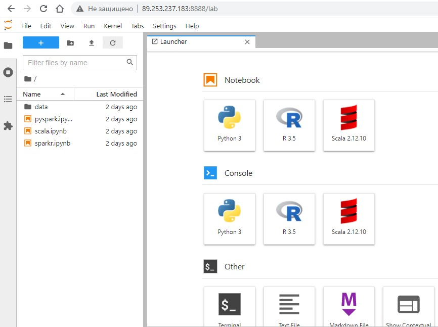

# Apache Hadoop and Spark Standalone Cluster on Docker

## Доступ к сборкам

- [Apache Spark](https://github.com/NameArtem/hadoop-spark-standalone-docker/tree/main/spark-standalone)
- [Apache Hadoop](https://github.com/NameArtem/hadoop-spark-standalone-docker/tree/main/hadoop-standalone)
- [Docker установка](#dckr)
- [Версии в сборках](#tech-stack)

Сборка кластера **Apache Spark** и **Apache Hadoop** для [курсов Анализ Больших данных](https://github.com/NameArtem/hse_spark_course). Кластер Apache Spark предоставляет доступ к **JupyterLab** в качестве интерфеса.

Для обучения Apache Spark на языках программирования **Scala**, **Python** (PySpark) и **R** (SparkR) .

**!!!** Максимально просто, в 3 шага: `git clone`, `docker-compose up`, использовать!

Пример **JupyterLab** с **Apache Spark**:

### Docker установка

 - Установите [Docker](https://docs.docker.com/get-docker/) и [Docker Compose](https://docs.docker.com/compose/install/), убедитесь, что версии пододят **infra** [версии](#tech-stack)

### Версии в сборках

- Инфраструктура кластера

| Component      | Version |
| -------------- | ------- |
| Docker Engine  | 1.13.0+ |
| Docker Compose | 1.10.0+ |

- Jupyter Kernels и языки программирования

| Spark | Hadoop | Scala   | [Scala Kernel](https://almond.sh/) | Python | [Python Kernel](https://ipython.org/) | R     | [R Kernel](https://irkernel.github.io/) |
| ----- | ------ | ------- | ---------------------------------- | ------ | ------------------------------------- | ----- | --------------------------------------- |
| 3.x   | 3.2    | 2.12.10 | 0.10.9                             | 3.7.3  | 7.19.0                                 | 3.5.2 | 1.1.1                                   |
| 2.x   | 2.7    | 2.11.12 | 0.6.0                              | 3.7.3  | 7.19.0                                 | 3.5.2 | 1.1.1                                   |

- Приложения

| Component      | Version                 | Docker Tag                                           |
| -------------- | ----------------------- | ---------------------------------------------------- |
| Apache Spark   | 2.4.0 \| 2.4.4 \| 3.0.0 | **\<spark-version>**                                 |
| JupyterLab     | 2.1.4 \| 3.0.0          | **\<jupyterlab-version>**-spark-**\<spark-version>** |
